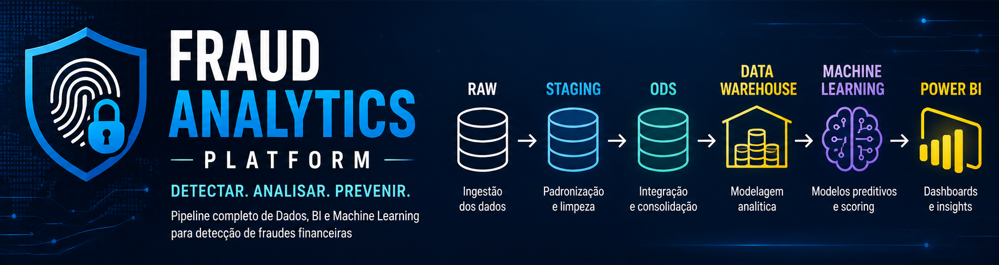

# Fraud Analytics Platform

Pipeline completo de **Engenharia de Dados, Análise de Dados, Business Intelligence e Machine Learning** para detecção de fraudes financeiras.

## Visão geral

O **Fraud Analytics Platform** é um projeto de portfólio desenvolvido para simular uma plataforma corporativa de prevenção a fraudes em uma fintech.

A solução integra **Python, SQL Server, SSIS, Power BI e Machine Learning**, seguindo uma arquitetura moderna em camadas (**Raw → Staging → ODS → Data Warehouse**) e boas práticas de Engenharia de Dados e Analytics.

O projeto utiliza o dataset **IEEE-CIS Fraud Detection (Kaggle)** para desenvolver um pipeline analítico completo, desde a ingestão dos dados até dashboards executivos e modelos preditivos.

---

## Objetivos do projeto

* construir um pipeline completo de dados;
* implementar processos de ETL e modelagem analítica;
* desenvolver indicadores e métricas de fraude;
* aplicar Engenharia de Atributos e Machine Learning;
* disponibilizar dashboards executivos em Power BI;
* documentar todas as etapas do projeto com foco em rastreabilidade e boas práticas.

---

## Arquitetura da solução

A plataforma foi projetada com separação entre ingestão, tratamento, integração e consumo analítico.


---

## Stack tecnológica

| Categoria        | Tecnologias               |
| ---------------- | ------------------------- |
| Linguagem        | Python                    |
| Banco de Dados   | SQL Server                |
| ETL              | Python, SQL Server e SSIS |
| BI               | Power BI                  |
| Machine Learning | Scikit-learn              |
| Versionamento    | Git e GitHub              |
| Documentação     | Markdown                  |

---

## Estrutura do projeto

```text
fraud-analytics-platform/
│
├── assets/
│   ├── icons/
│   ├── logos/
│   └── templates/
│
├── data/
│   ├── raw/
│   ├── staging/
│   ├── processed/
│   └── samples/
│
├── docs/
├── images/
│   ├── architecture/
│   ├── dashboards/
│   ├── diagrams/
│   └── profiling/
│
├── notebooks/
├── python/
├── sql/
├── ssis/
├── powerbi/
├── models/
├── tests/
├── requirements.txt
└── README.md
```

---

## Documentação

Toda a documentação do projeto está disponível na pasta **docs/**.

| Documento                    | Descrição                                  |
| ---------------------------- | ------------------------------------------ |
| 01_Project_Charter           | Escopo e objetivos do projeto              |
| 02_Business_Understanding    | Problema de negócio e objetivos analíticos |
| 03_Project_Roadmap           | Planejamento das sprints                   |
| 04_Solution_Architecture     | Arquitetura da solução                     |
| 05_Requirements              | Requisitos funcionais e técnicos           |
| 06_Data_Profiling_Report     | Análise inicial dos dados                  |
| 07_Data_Quality_Report       | Avaliação da qualidade dos dados           |
| 08_Exploratory_Data_Analysis | Análise exploratória e insights            |
| 09_Data_Dictionary           | Dicionário analítico das variáveis         |

---

## Principais insights da EDA

A análise exploratória identificou fatores com forte associação ao risco de fraude.

### ProductCD

A categoria **C** apresentou taxa de fraude de **11,69%**, representando o fator de risco mais relevante identificado na análise.

### TransactionHour

O pico ocorreu às **7h**, com **10,61%** de fraude, evidenciando forte comportamento temporal das transações fraudulentas.

### DeviceType

Dispositivos **mobile** apresentaram **10,17%** de fraude, indicando elevado risco associado ao contexto do dispositivo.

### card6

Cartões de **crédito** apresentaram taxa de fraude de **6,68%**, contra **2,43%** para cartões de débito.

---

## Resultados analíticos

### Arquitetura


### Perfil temporal das fraudes

*Gráfico disponível em* `images/profiling/eda_transactionhour.png`

### Taxa de fraude por categoria de produto

*Gráfico disponível em* `images/profiling/eda_productcd.png`

---

## Roadmap do projeto

* Concepção e arquitetura
* Data Profiling
* Data Quality
* Exploratory Data Analysis
* Engenharia de Dados (ETL)
* ODS e Data Warehouse
* Engenharia de Atributos
* Machine Learning
* Dashboards em Power BI
* Deploy e monitoramento

---

## Status do projeto

**Sprint 1 — Concepção:** concluída

**Sprint 2 — Entendimento dos Dados:** concluída

* Project Charter
* Business Understanding
* Solution Architecture
* Data Profiling
* Data Quality
* Exploratory Data Analysis
* Data Dictionary

**Sprint 3 — Engenharia de Dados (ETL):** em planejamento

---

## Próxima etapa

A Sprint 3 contempla a construção do pipeline **Raw → Staging → ODS** utilizando **Python + SQL Server**, preparando os dados para o Data Warehouse, os modelos de Machine Learning e os dashboards em Power BI.

---

## Autor

**Cláudia Kênia da Silva**

LinkedIn: https://linkedin.com/in/claudia-kenia

GitHub: https://github.com/clauke

---

Este projeto foi desenvolvido como portfólio para demonstrar competências em **Engenharia de Dados, Análise de Dados, Business Intelligence e Machine Learning**, utilizando uma arquitetura escalável e documentação completa do ciclo analítico.
